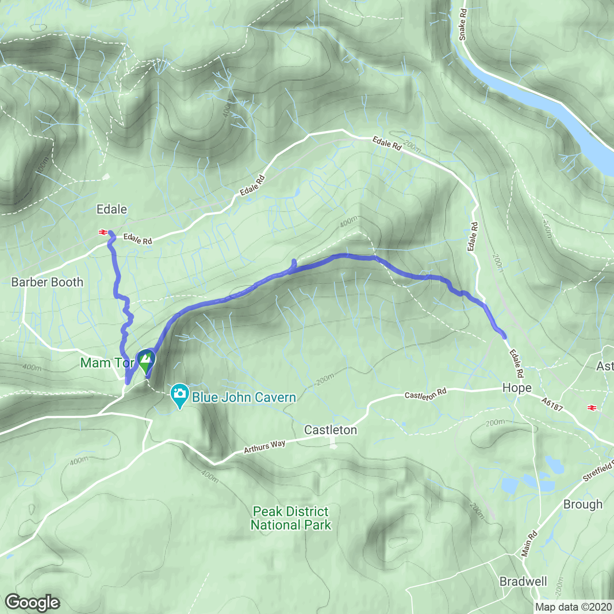
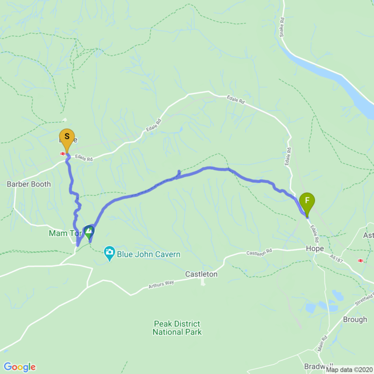

# Polyline.jl

[](https://travis-ci.com/NikStoyanov/Polyline.jl)
[](https://coveralls.io/github/NikStoyanov/Polyline.jl?branch=master)

A Julia implementation of the algorithm described in [Google's Encoded Polyline Format](https://developers.google.com/maps/documentation/utilities/polylinealgorithm)
to encode/decode polylines and plot them using Google Maps.

## Polyline.jl with Google Maps

Parse a GPX file.
```julia
using Polyline

# Load gpx file and parse.
gpxFile = readGPX("./examples/route.gpx")
gpxRoute = parseGPX(gpxFile)
```

Encode/decode polyline.
```julia
# Encode polyline
polyline = encodePolyline(gpxRoute)

# Decode polyline
route = decodePolyline(polyline)
```

Plot using Google Maps. You need to obtain a token from the static maps API which you can find here:
https://developers.google.com/maps/documentation/maps-static/get-api-key
```julia
# Then either set the token as the environment variable GOOGLE_MAPS_API
# url = mapsURL(polyline)

# Or pass the API token as an argument.
url = mapsURL(polyline; token="...")

# With the defaults you can plot the route.
getMapImage(url; pathFig="/tmp/fig1.png")
```


```julia
# Full customization.
url = mapsURL(polyline; token="...",
              type = "roadmap", # https://developers.google.com/maps/documentation/maps-static/dev-guide#MapTypes
              size = 1000,
              scale = 2, # https://developers.google.com/maps/documentation/maps-static/dev-guide#scale_values
              MarkersStart = (gpxRoute[1, 1], gpxRoute[1, 2]),
              MarkersEnd = (gpxRoute[end, 1], gpxRoute[end, 2]))

getMapImage(url; pathFig="/tmp/fig2.png")
```

